INSTITUTO POLITECNICO NACIONAL  

ESCUELA SUPERIOR DE COMPUTO 

Tarea 6 Implementación de un servicio web estilo rest 

Materia: Diseño de Sistemas Distribuidos 

Grupo: 4CV13  

Alumno: Mora Guzmán Jose Antonio  

Fecha entrega: viernes 29 octubre 2021 

1. Crear una máquina virtual con Ubuntu 18 con al menos 1GB de memoria RAM. Abrir el puerto 8080 para el protocolo TCP. 

Primero en el portal de azure seleccionamos maquina virtual 

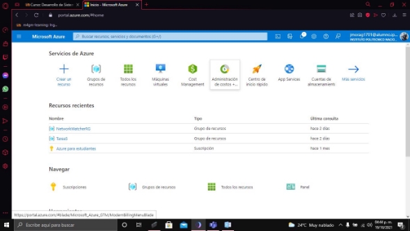

Le damos clic en crear y crear maquina virtual: 

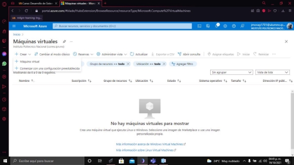Seleccionamos el grupo de recursos, la región y el nombre de nuestra maquina virtual, en mi caso: REST2018631591, tambien seleccionamos el sistema operativo a utilizar 

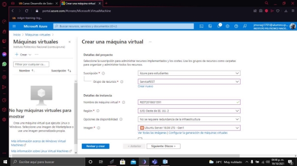

Seleccionamos el tamaño y en tipo de autenticación seleccionamos contraseña y ponemos un usuario y contraseña 

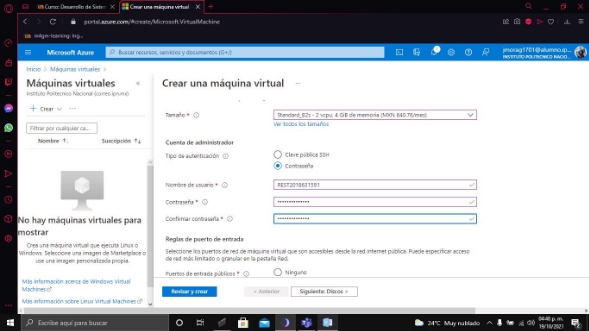

En discos seleccionamos HDD estándar  

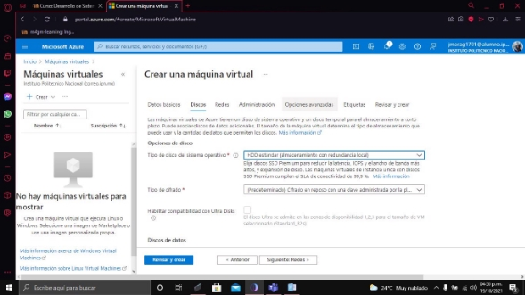

Le damos en revisar y crear  

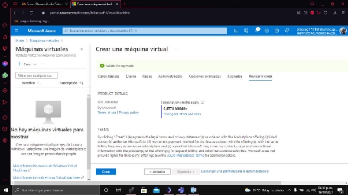

Una vez creada vamos al recurso y seleccionamos redes 

Agregamos regla de puerto de entrada  

Y abrimos el puerto 8080  

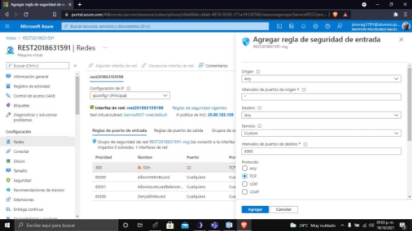

2. Instalar JDK8 ejecutando los siguientes comandos en la máquina virtual: 

sudo apt update 

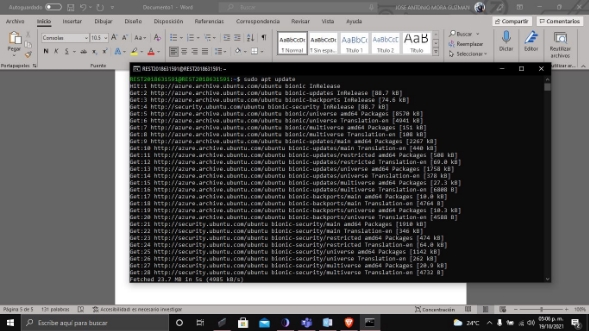

sudo apt install openjdk-8-jdk-headless 

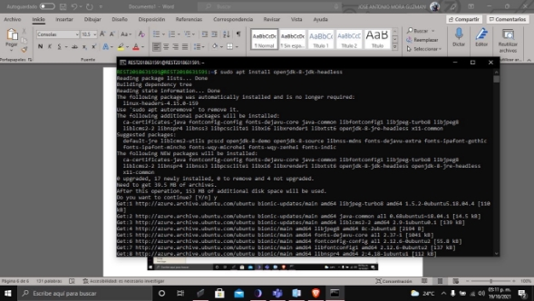

3. Descargar la distribución binaria de Tomcat 8 de la siguiente URL (descargar la opción Core "zip"[): https://tomcat.apache.org/download-80.cgi ](https://tomcat.apache.org/download-80.cgi)

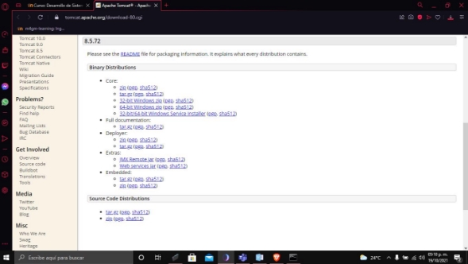

4. Copiar a la máquina virtual el archivo ZIP descargado anteriormente y desempacarlo utilizando el comando unzip.  

Scp archivo user@ip: ~/ 

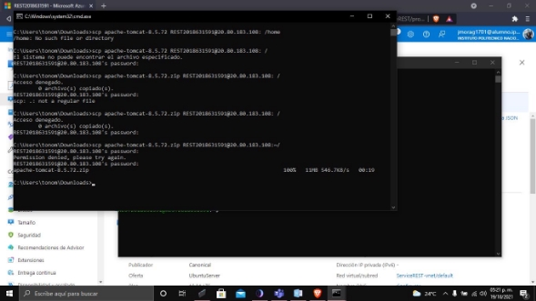

Primero instalamos el unzip  

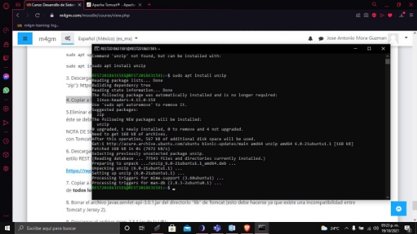

Y despues usamos el unzip para desempaquetar el archivo  

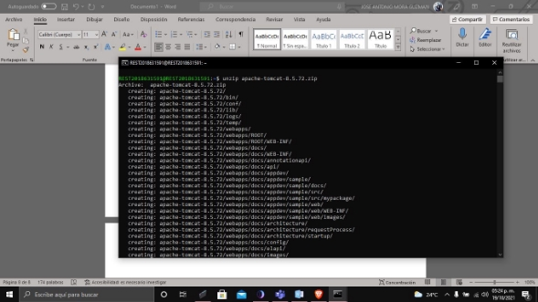

5.Eliminar el directorio webapps el cual se encuentra dentro del directorio de Tomcat. Crear un nuevo directorio webapps y dentro de éste se deberá crear el directorio ROOT. 

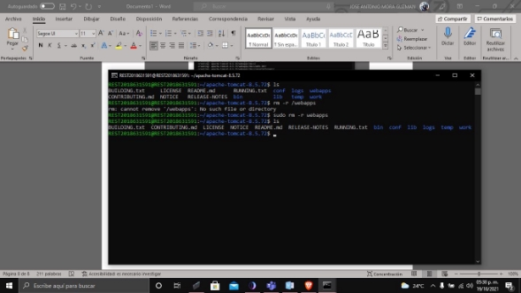

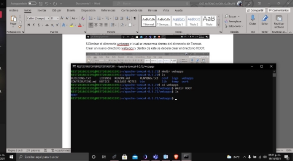

NOTA DE SEGURIDAD: Lo anterior se recomienda debido a que se han detectado vulnerabilidades en algunas aplicaciones que vienen con Tomcat, estas aplicaciones se encuentran originalmente instaladas en los directorios webapps y webapps/ROOT. 

\6. Descargar la biblioteca "Jersey" de la siguiente URL. Jersey es una implementación de JAX-RS lo cual permite ejecutar servicios web estilo REST sobre Tomcat: 

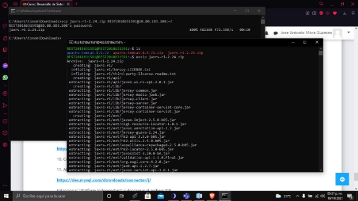

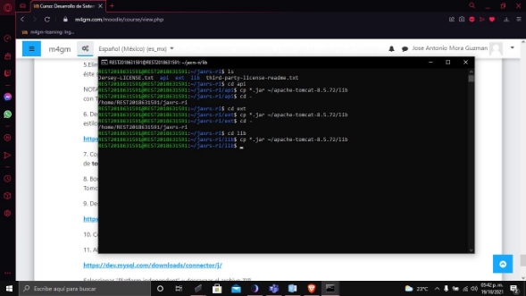

8. Borrar el archivo javax.servlet-api-3.0.1.jar del directorio "lib" de Tomcat (esto debe hacerse ya que existe una incompatibilidad entre Tomcat y Jersey 2). 

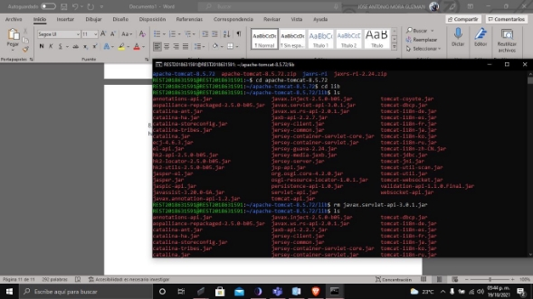

9. Descargar el archivo gson-2.3.1.jar de la URL: [**https://repo1.maven.org/maven2/com/google/code/gson/gson/2.3.1/gson- 2.3.1.jar** ](https://repo1.maven.org/maven2/com/google/code/gson/gson/2.3.1/gson-2.3.1.jar)
9. Copiar el archivo gson-2.3.1.jar al directorio "lib" de Tomcat. 

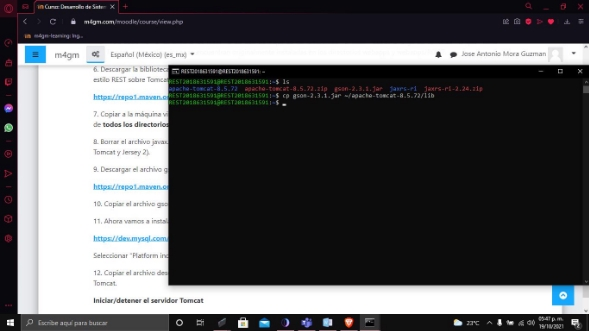

11. Ahora vamos a instalar el driver de JDBC para MySQL. Ingresar a la siguiente URL: 

[**https://dev.mysql.com/downloads/connector/j/** ](https://dev.mysql.com/downloads/connector/j/)

Seleccionar “Platform independent" y descargar el archivo ZIP. 

12. Copiar el archivo descargado a la máquina virtual, desempacarlo y copiar el archivo mysql-connector...jar al directorio "lib" de Tomcat. 

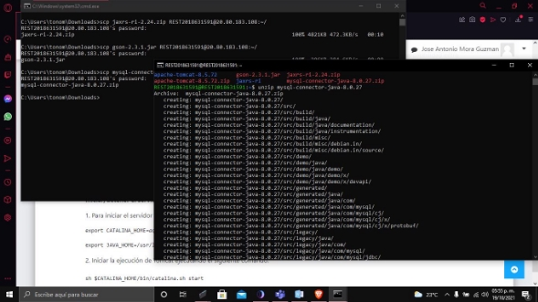

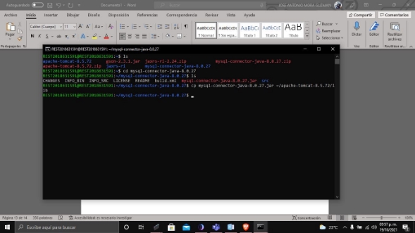

**Iniciar/detener el servidor Tomcat** 

1. Para iniciar el servidor Tomcat es **necesario** definir las siguientes variables de entorno: 

export CATALINA\_HOME=*aquí va la ruta del directorio de Tomcat 8* 

export JAVA\_HOME=/usr/lib/jvm/java-8-openjdk-amd64 

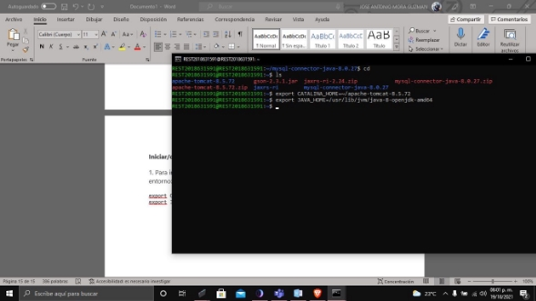

2. Iniciar la ejecución de Tomcat ejecutando el siguiente comando: 

sh $CATALINA\_HOME/bin/catalina.sh start 

3. Para detener la ejecución de Tomcat se deberá ejecutar el siguiente comando: 

sh $CATALINA\_HOME/bin/catalina.sh stop 

Notar que Tomcat se ejecuta sin permisos de administrador (no se usa "sudo"), lo cual es muy importante para prevenir que algún atacante pueda entrar a nuestro sistema con permisos de super-usuario. 

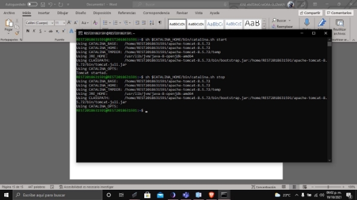

**Instalación de MySQL** 

1. Actualizar los paquetes en la máquina virtual ejecutando el siguiente comando: 

sudo apt update

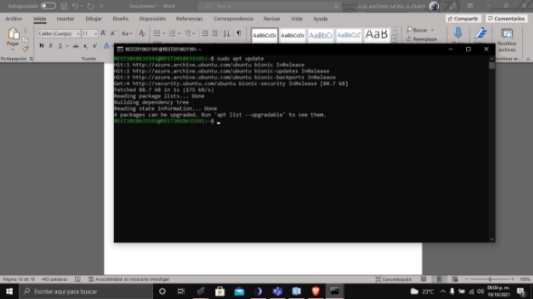

2. Instalar el paquete default de MySQL: 

sudo apt install mysql-server

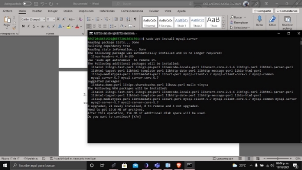

3. Ejecutar el script de seguridad: 

sudo mysql\_secure\_installation

Press y|Y for Yes, any other key for No: **N** 

New password: *contraseña-de-root-en-mysql*

Re-enter new password: *contraseña-de-root-en-mysql*

Remove anonymous users? (Press y|Y for Yes, any other key for No) : **Y** 

Disallow root login remotely? (Press y|Y for Yes, any other key for No) : **Y** 

Remove test database and access to it? (Press y|Y for Yes, any other key for No) : **Y** Reload privilege tables now? (Press y|Y for Yes, any other key for No) : **Y** 

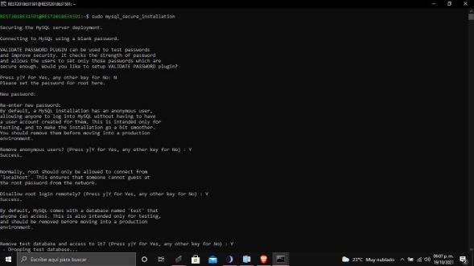

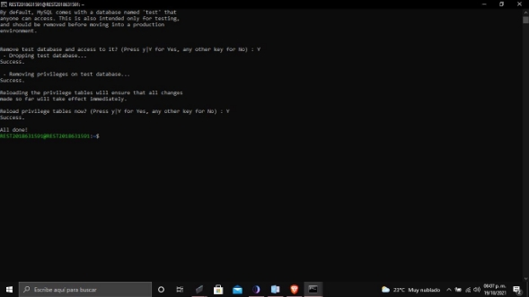

4. Ejecutar el monitor de MySQL: 

sudo mysql 

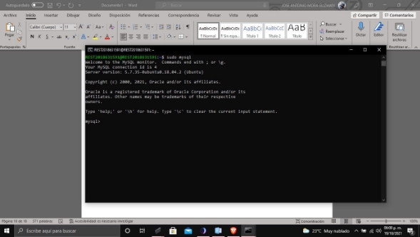

5. Ejecutar el siguiente comando SQL para modificar la contraseña de root: 

ALTER USER 'root'@'localhost' IDENTIFIED WITH mysql\_native\_password BY '*contraseña-de-root-en-mysql*';

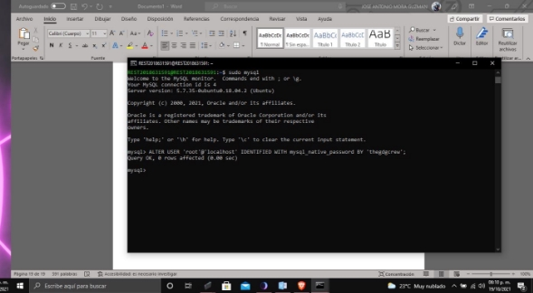

6. Actualizar los privilegios: 

FLUSH PRIVILEGES;

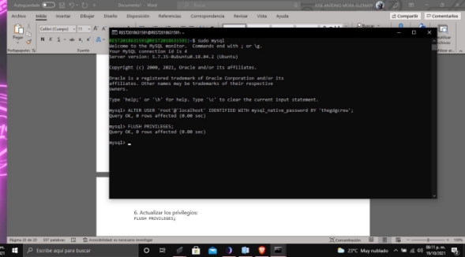

7. Ejecutar el siguiente comando para salir del monitor de MySQL: quit 

**Crear un usuario en MySQL** 

1. Ejecutar el monitor de MySQL: 

mysql -u root -p 

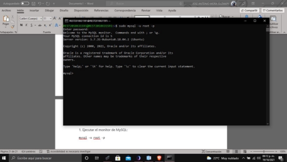

2. Crea el usuario "hugo": 

create user hugo@localhost identified by '*contraseña-del-usuario-hugo*'; 

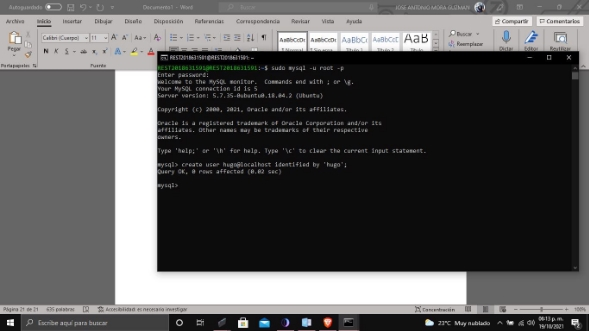

3. Otorgar todos los permisos al usuario "hugo" sobre la base de datos "servicio\_web": 

grant all on servicio\_web.\* to hugo@localhost; 

4. Ejecutar el siguiente comando para salir del monitor de MySQL: 

quit 

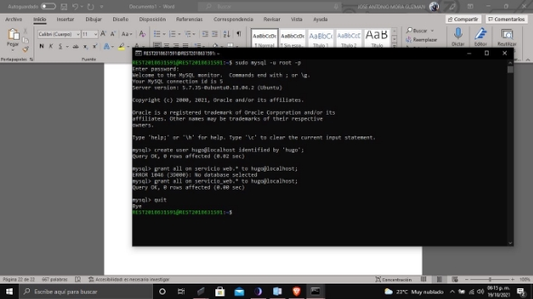

**Crear la base de datos** 

1. Ejecutar el monitor de MySQL (notar que ahora se utiliza el usuario "hugo"): 

mysql -u hugo -p 

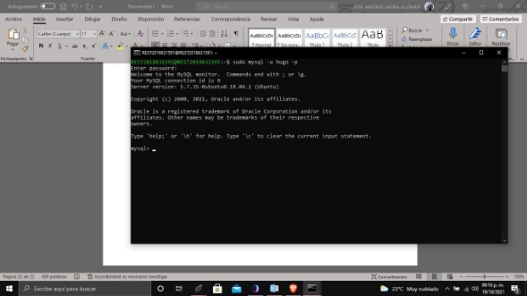

2. Crear la base de datos "servicio\_web": 

create database servicio\_web; 

3. Conectar a la base de datos creada anteriormente: use servicio\_web; 

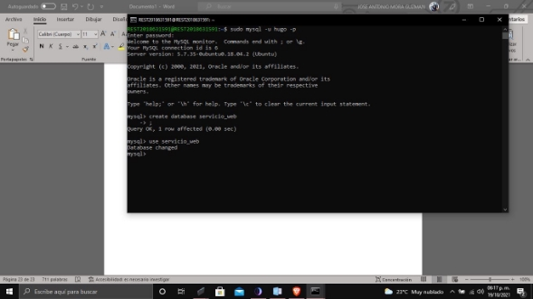

4. Crear las tablas "usuarios" y "fotos\_usuarios", así mismo, se crea una regla de integridad referencial y un índice único: 

create table usuarios 

( 

`    `id\_usuario integer auto\_increment primary key, 

`    `email varchar(256) not null, 

`    `nombre varchar(100) not null, 

`    `apellido\_paterno varchar(100) not null, 

`    `apellido\_materno varchar(100), 

`    `fecha\_nacimiento date not null, 

`    `telefono varchar(20), 

`    `genero char(1) 

); 

create table fotos\_usuarios 

( 

`    `id\_foto integer auto\_increment primary key, 

`    `foto longblob, 

`    `id\_usuario integer not null 

); 

alter table fotos\_usuarios add foreign key (id\_usuario) references usuarios(id\_usuario); 

create unique index usuarios\_1 on usuarios(email); 

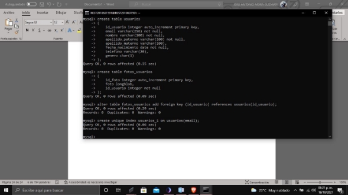

5. Salir del monitor de MySQL: 

quit 

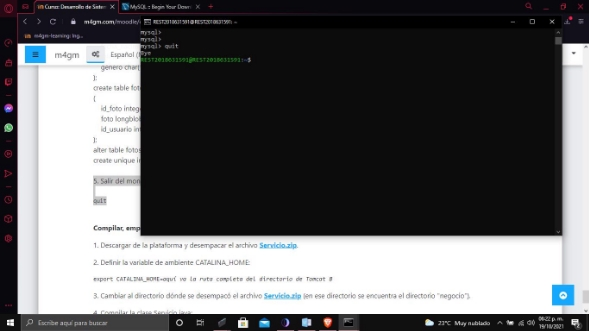

**Compilar, empacar y desplegar el servicio web** 

1. Descargar de la plataforma y desempacar el archivo[` `**Servicio.zip**.](https://m4gm.com/moodle/mod/resource/view.php?id=505) 
1. Definir la variable de ambiente CATALINA\_HOME: 

export CATALINA\_HOME=*aquí va la ruta completa del directorio de Tomcat 8*  

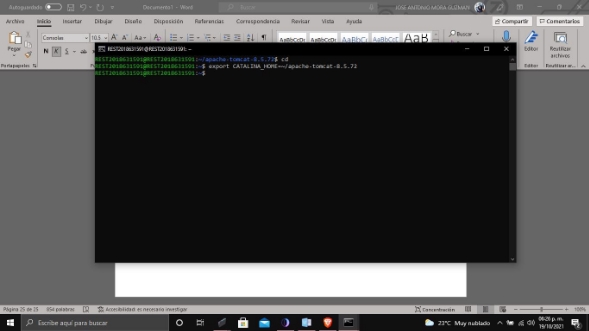

3. Cambiar al directorio dónde se desempacó el archivo[` `**Servicio.zip** ](https://m4gm.com/moodle/mod/resource/view.php?id=505)(en ese directorio se encuentra el directorio "negocio"). 
3. Compilar la clase Servicio.java: 

javac -cp $CATALINA\_HOME/lib/javax.ws.rs-api- 2.0.1.jar:$CATALINA\_HOME/lib/gson-2.3.1.jar:. negocio/Servicio.java 

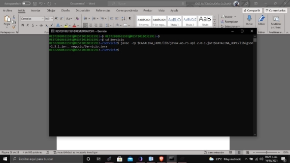

5. Editar el archivo "context.xml" que está en el directorio "META-INF" y definir el username de la base de datos y el password correspondiente. El usuario "hugo" fue creado en el paso 2 de la sección **Crear un usuario en MySQL**. 

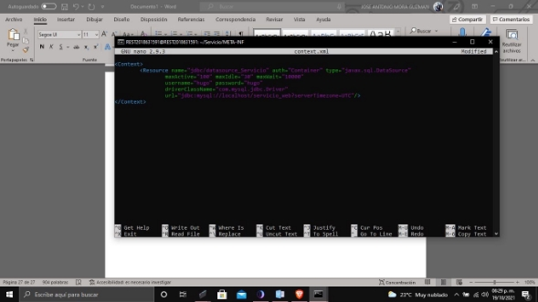

6. Ejecutar los siguientes comandos para crear el servicio web para Tomcat (notar que los servicios web para Tomcat son archivos JAR con la extensión .war): 

rm WEB-INF/classes/negocio/\* 

cp negocio/\*.class WEB-INF/classes/negocio/. 

jar cvf Servicio.war WEB-INF META-INF 

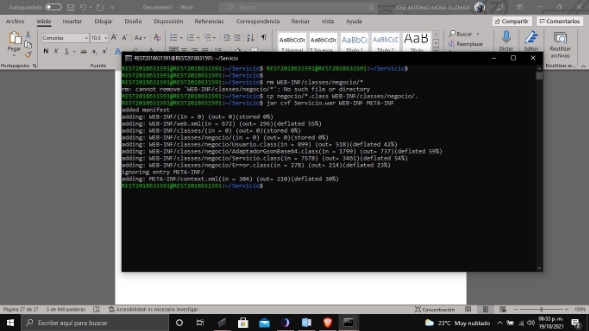

7. Para desplegar (*deploy*) el servicio web, copiar el archivo **Servicio.war** al directorio "webapps" de Tomcat. Notar que Tomcat desempaca automáticamente los archivos con extensión .war que se encuentran en el directorio webapps de Tomcat. 

Para eliminar el servicio web se deberá eliminar el archivo "Servicio.war" y el directorio "Servicio", en éste orden. 

Cada vez que se modifique el archivo Servicio.java se deberá compilar, generar el archivo Servicio.war, borrar el archivo Servicio.war y el directorio Servicio del directorio webapps de Tomcat, y copiar el archivo Servicio.war al directorio webapps de Tomcat. 

**Probar el servicio web utilizando HTML-Javascript** 

1. Copiar el archivo[` `**usuario_sin_foto.png** ](https://m4gm.com/moodle/mod/resource/view.php?id=508)al subdirectorio webapps/ROOT de Tomcat. 

Notar que todos los archivos que se encuentran en el directorio webapps/ROOT de Tomcat son accesibles públicamente. 

Para probar que Tomcat esté en línea y el puerto 8080 esté abierto, ingresar la siguiente URL en un navegador: http://*ip-de-la-máquina-virtual*:8080[/usuario_sin_foto.png ](https://m4gm.com/moodle/mod/resource/view.php?id=508)

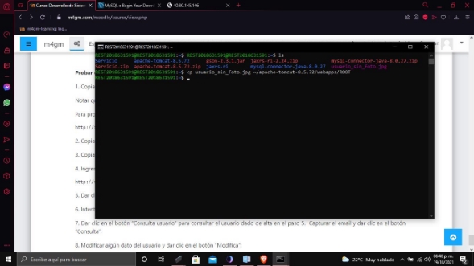

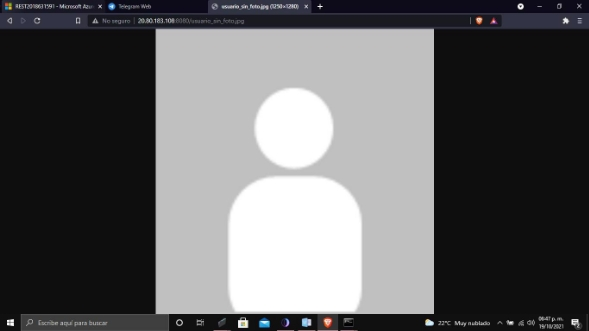

2. Copiar el archivo[` `**WSClient.js** ](https://m4gm.com/moodle/mod/resource/view.php?id=506)al directorio webapps/ROOT de Tomcat. 
2. Copiar el archivo[ prueba.html ](https://m4gm.com/moodle/mod/resource/view.php?id=507)al directorio webapps/ROOT de Tomcat. 

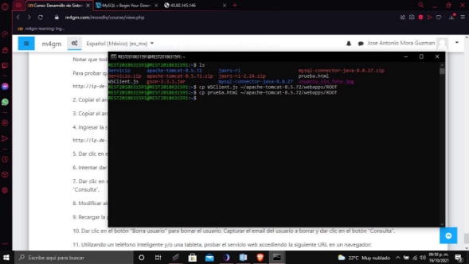

4. Ingresar la siguiente URL en un navegador: 

http://*ip-de-la-máquina-virtual*:8080[/prueba.html ](https://m4gm.com/moodle/mod/resource/view.php?id=507)

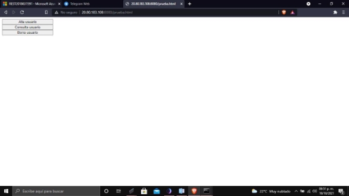

5. Dar clic en el botón “Alta usuario” para dar de alta un nuevo usuario. Capturar los campos y dar clic en el botón “Alta”. 

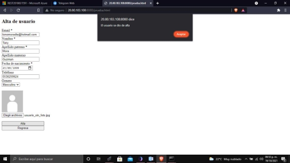

6. Intentar dar de alta otro usuario con el mismo email (se deberá mostrar una ventana de error indicando que el email ya existe) 

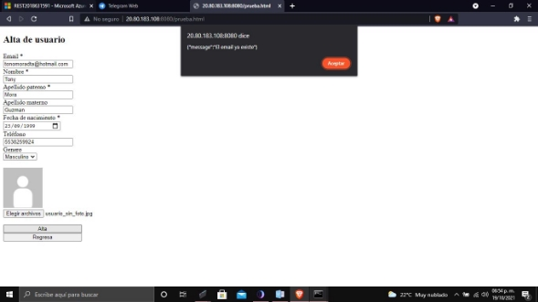

7. Dar clic en el botón “Consulta usuario” para consultar el usuario dado de alta en el paso 5.  Capturar el email y dar clic en el botón “Consulta”, 

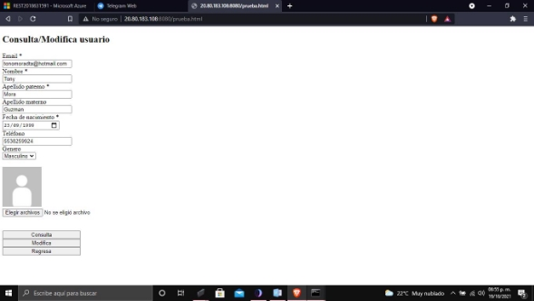

8. Modificar algún dato del usuario y dar clic en el botón “Modifica”: 

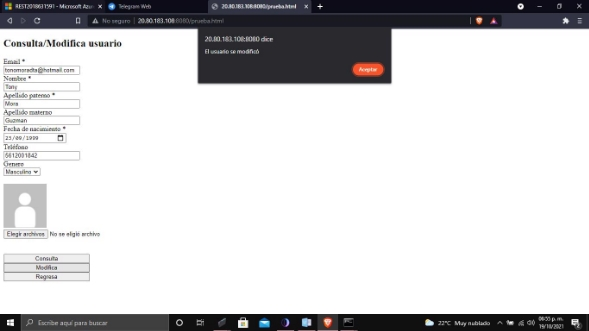

9. Recargar la página actual y consultar el usuario modificado, para verificar que la modificación se realizó. 

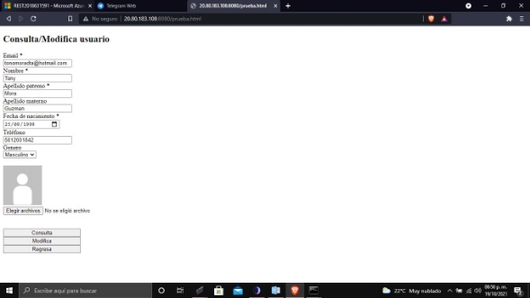

10. Dar clic en el botón “Borra usuario” para borrar el usuario. Capturar el email del usuario a borrar y dar clic en el botón “Consulta”. 

11. Utilizando un teléfono inteligente y/o una tableta, probar el servicio web accediendo la siguiente URL en un navegador: 

http://*ip-de-la-máquina-virtual*:8080[/prueba.html ](https://m4gm.com/moodle/mod/resource/view.php?id=507)

Ahora capturamos la imagen: 

Primero usamos el comando sudo waagent -deprovision 

En azure seleccionamos la opcion captura: 

Y seleccionamos las siguientes opciones  

Y listo  

**Conclusiones** 

Esta practica se me hizo bastante interesante, en lo personal nunca había visto un servicio web estilo REST y me pareció interesante la manera de implementarlo, si bien la configuración en la maquina virtual es algo tardada me puse a investigar mas y descubrí maneras mas sencillas de implementar este tipo de servicios directamente desde azure, pero siempre es bueno el saber como configurarlo por tu cuenta. 
